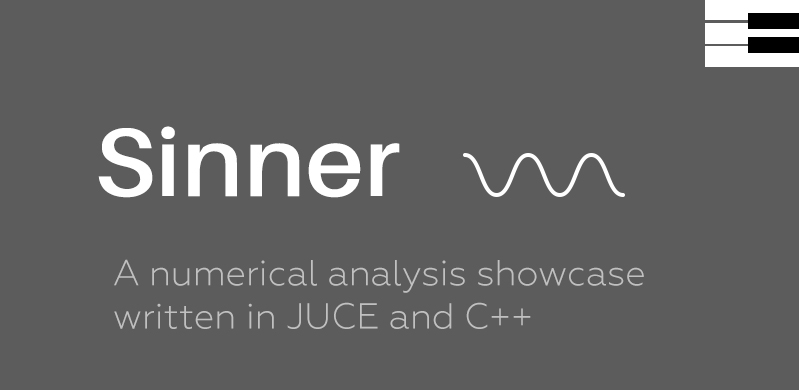

# About

Sinner _(pronounced SAH-IH-NER)_ is a sine wave synthesizer designed to showcase Linear Interpolation 
using JUCE and C++. There's also a neat metallic effect discovered during development.
 
## How to run:

Sinner has been tested on Windows 10 and Mac OS X El Capitan. The primary development has been done in OS X. Linux is supported, but not tested as of 26th November 2017. You can run the makefile to compile it.

To run the app, either use the .exe or .app provided (in the  Sinner/Builds/VisualStudio2017/x64/Debug/App or Sinner/Builds/MacOSX/build/Debug directories) or compile it yourself, using the directives below

## Compiling on Windows:

You'll need Microsoft Visual Studio 2015 or later. 
If you do not have it, install it and navigate to the Sinner/Builds/VisualStudio2017 directory and open the Sinner.sln file with Visual Studio. Install any required dependencies and then, on the toolbar at the top of the screen, under Build, hit Compile (CTRL + F7). 

This will create an Newtonium.exe executable in the Sinner/Builds/VisualStudio2017/x64/Debug/App directory
_(note that it's called Newtonium because of a name change mid-development)_
Just run it and there you have it.

## Compiling on OS X:

For OS X users, Xcode 8.2.1 or later is required. The latest version is recommended.

Navigate to the Sinner/Builds/MacOSX, and open the Sinner.xcodeproj in Xcode. After that, on the top left corner of the screen, press the play button and you'll compile an executable to Sinner/Builds/MacOSX/build/Debug, named 
Newtonium.app, and that's it.

## How to use:

Make sure you adjust your volume accordingly! The frequencies available range from negative values to ultrasound. 
Do not use the Effect and Interpolate buttons together. Doing so will just reset their stage to untoggled.
